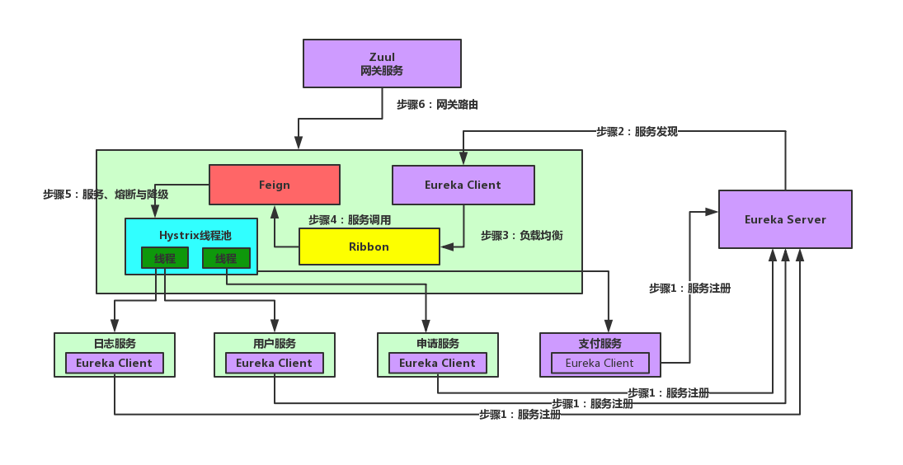
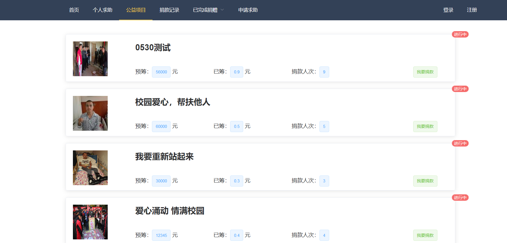
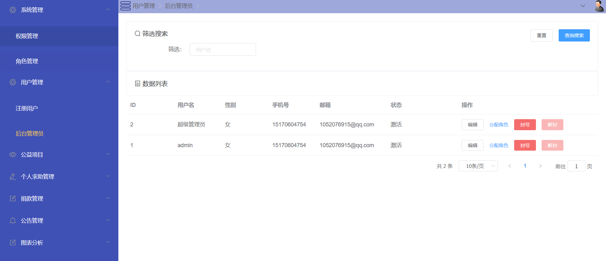
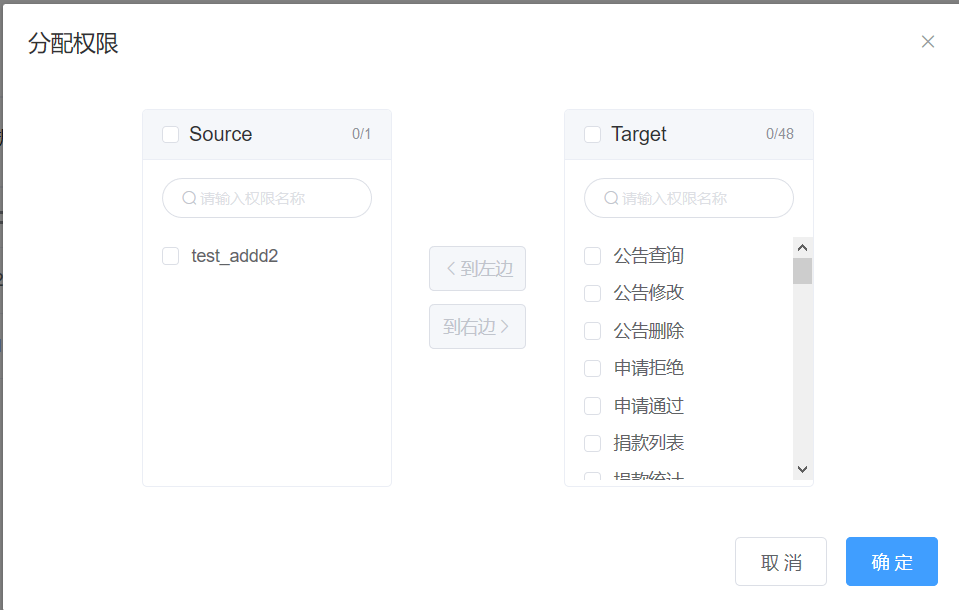
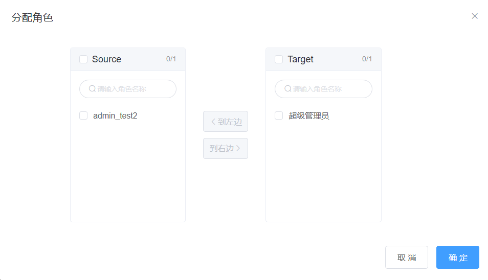

# **Spring Cloud + Vue 微服务项目**

## 架构图



本项目分为前端和后端，当前模块为后端工程。

## 所使用相关技术：

注册中心：Spring Cloud Eureka

网关中心：Spring Cloud Zuul

服务配置：Spring Cloud Config

链路追踪：Spring Cloud Zipkin

数据库连接：Druid、MyBatis、Spring Data JPA

服务鉴权：Spring Security + JWT

数据库：MySQL8

服务之间调用： Feign

熔断机制：Hystrix

消息队列：RabbitMQ

## 系统各模块介绍

donate-cloud：项目父模块，所有以下子模块依赖该父模块（可在该pom文件加入所需要的依赖）

api-module : 项目中所使用到的POJO

commons : 工具类

config-center : 分布式配置中心

gateway-zuul : 微服务网关层，所有请求都经过网关请求

log-center : 日志业务服务模块

log-starter : 日志服务组件

monitor-center : ，SpringBoot Admin 微服务监控中心

oauth-center：鉴权

pay-center：支付中心；使用的是支付宝的当面付

register-center：注册中心

user-apply：申请服务

use-center：用户服务

sql：存放sql文件

img: 运行效果图

## 项目依赖环境：

1. Mysql：8.0.15(支持8版本)
2. Redis：5.0.5
3. RabbitMq：3.7.15
4. jdk：1.8.0_141-b15(必须是1.8，使用了1.8特性)
5. idea：2017.3.2
6. lombok插件(po类使用到了，不装插件会报错)

## 项目配置

1.RabbitMq

```yaml
 全局替换：
 rabbitmq:
    host: 127.0.0.1
    port: 5672
    username: donate-dev
    password: donate-dev
```

2.redis

```yaml
 全局替换：
redis:
    host: 127.0.0.1
    port: 6379
    password:
```

3.mysql

```yaml
 全局替换：
driver-class-name: com.mysql.jdbc.Driver
    url: jdbc:mysql://127.0.0.1:3306/donate_log?useUnicode=true&characterEncoding=utf-8&allowMultiQueries=true&useSSL=false
    username: root
    password: 123456
```

4.pay-center.yml

```yaml
  my:
    token: 123456
    encryptAESKey: #当面付

    privateKey: #当面付
    publicKey: #当面付
    appId: #当面付
```

5.阿里云OSS配置修改

```yaml
OSSClientUtil.java文件：

 	/**
     * endpoint
     */
    private String endpoint = "oss-cn-beijing.aliyuncs.com";

    /**
     * accessKey
     */
    private String accessKeyId = "accessKey";

    /**
     * accessKey secret
     */
    private String accessKeySecret = "accessKey secret";
    
    /**
     * 空间
     */
    private String bucketName = "donate-store";

    /**
     * 文件存储目录
     */
    private String filedir = "img/";
```

6.数据库文件导入

```yaml
在sql文件夹下分别有donate_apply.sql donate _log.sql donate_oauth.sql donate_pay.sql donate_user.sql文件，建立相对应的数据库
```

7.微服务启动顺序

```yaml
RegisterCenterApplication
ConfigCenterApplication
其他微服务任意顺序启动
最后启动GatewayZuulApplication
```

## 效果图展示


**前端首页**




**后端首页**




**分配权限**




**分配角色**



